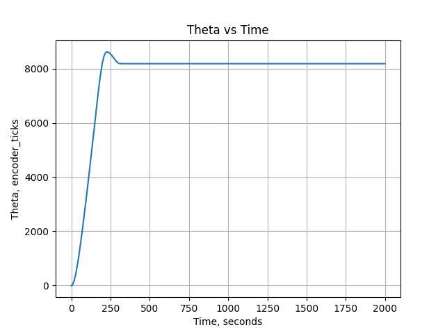
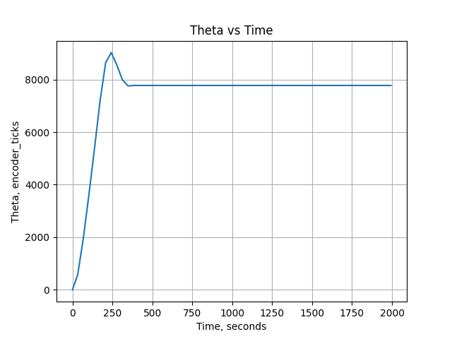
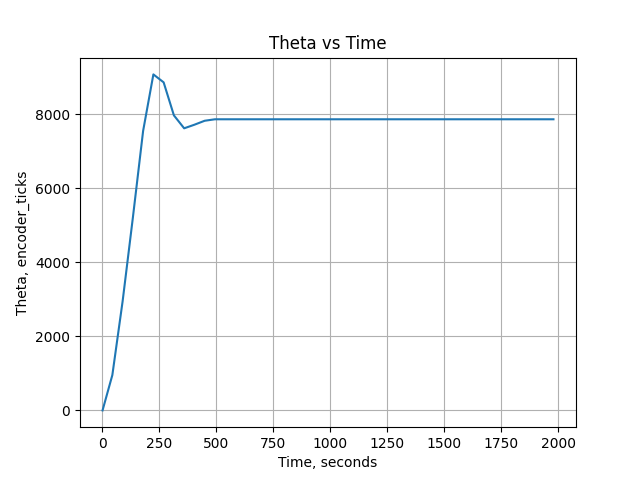

# ME_405_lab3

Adam Westfall
Jason Davis
Conor Fraser

Closed Loop Control and Multitasking for DC Motors:

Lab 3 introduces multitasking as a way to simultaneously control two motors.
The motor, motor driver, encoder, and closed loop controller have the functionality to run for two motors,
but to do so, multitasking is required. By assigning a task for each motor's control loop and then quickly
switching between those tasks, both motors can effectively be controlled in tandem.

From this inital description, it's clear that making the tasks run as quickly as possible would allow 
for the controller to update quicker and therefore provide a better motor response. The primary drawback to this 
approach stems from the potential to "corrupt" the data being sent from the controller if the tasks ever start to overlap.
If the timer for the tasks to run is too small, there is a chance one task will start before the other is completely finished.
For our purposes, it makes the most sense to set the multitaskign rate to the lowest number possible while still maintaining 
adequate closed loop motor control.

This is outlined in the following plots which show how different multitasking rates affect the Transient of the 
closed loop motor control.

Figure 1. Shows how a 10ms timer for multiasking creates a controller response that
reaches steady state in roughly 300ms.
The overshoot is roughly 600 encoder ticks over the 8000 tick goal.
The curve is smooth without sharp corners or jagged edges.

Figure 2. Shows how a 35ms timer for multitasking creates a controller response that
reaches steady state in roughly 350ms.
The overshoot is roughly 900 encoder ticks over the 8000 tick goal.
The curve is more jagged than what was seen in Figure 1.
Both the transient and overshoot values at the longer multitasking time are 
inferior to that seen in Figure 1, but the overall functionality is unscathed.

Figure 3. Shows how a 4	5ms timer for multitasking creates a controller response that
reaches steady state in roughly 350ms.
The overshoot is roughly 900 encoder ticks over the 8000 tick goal.
The curve is more jagged than what was seen in Figure 1 and Figure 2.
Both the transient and overshoot values at the longer multitasking time are 
inferior to that seen in Figure 1. The 45ms task timer is similar to the 
35ms task timer except more jagged. It is still functional at this slower timer,
but the degredation of controller quality is clear.